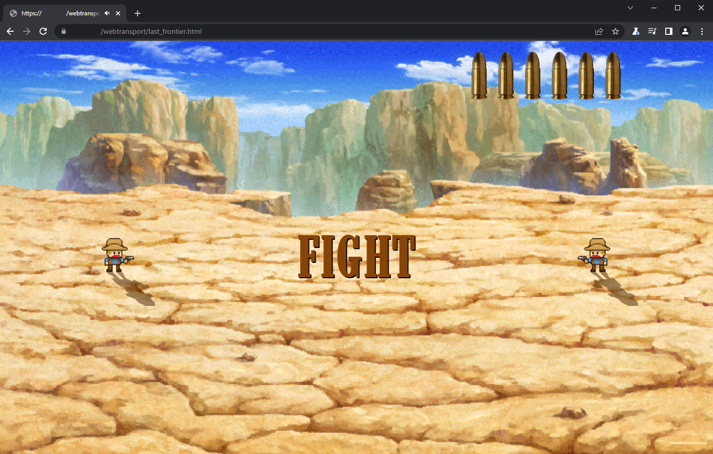
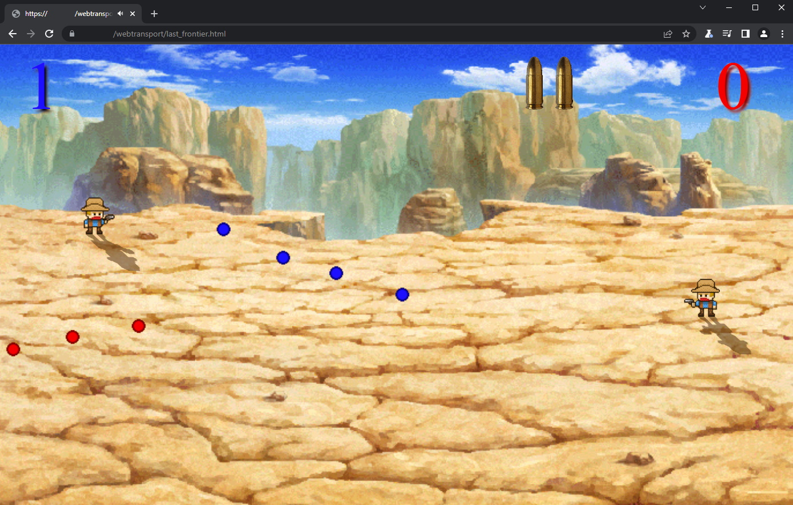

Last Frontier
-------------

This repository contains a technical demonstration of using the datagram messaging capability of the [WebTransport protocol](https://www.w3.org/TR/webtransport/) to implement a real time low latency action game in a web browser.





Technical Details
=================

WebTransport supports sending UDP-like datagrams between a client and a server. These datagrams provide a means of unreliable low latency communication without risking head-of-line blocking that reliable stream-based protocols (WebSockets and TCP) must suffer from.

The game client is implemented using JavaScript + WebGL + WebTransport. The game server is written in Python and relies on the aioquic package.

The game is implemented in the file last_frontier.html. The server is implemented in the file game_server.py.

Running the Game
================

To set up the game to be playable locally, perform the following:

1. Install Python 3.x and aioquic (`pip3 install aioquic`).
2. Set up a web server and have it serve the `site/` subdirectory.
3. If you do not have a HTTPS capable web server, then set up a self-signed HTTPS certificate via
```
openssl req -newkey rsa:2048 -nodes -keyout cert.key -x509 -out cert.pem -subj "/CN=Test Certificate" -addext "subjectAltName = DNS:localhost"
```
Then generate a fingerprint hash of the certificate:
```
openssl x509 -pubkey -noout -in cert.pem | openssl rsa -pubin -outform der | openssl dgst -sha256 -binary | openssl enc -base64
```
and run Chrome with command line flags
```
--ignore-certificate-errors-spki-list=<hash> --origin-to-force-quic-on=localhost:4433
```
If your web server is HTTPS capable, this step can be skipped, and you can use the site HTTPS certificate instead.

4. Run the game WebTransport server with
```
python game_server.py cert.pem cert.key
```
5. Visit the site `last_frontier.html` on your web server to play.

Credits
=======

- bg.png from https://www.gamedevmarket.net/asset/scrolling-repeatable-background-canyon/
- bell.mp3, crow.mp3, dead*.wav, reload.mp3, shoot.mp3 from https://pixabay.com/
- Marlboro.ttf and Driftwood.ttf from https://www.1001fonts.com/
- Background music from https://www.youtube.com/watch?v=dDJQ-jqHFm0
- Cowboy character from https://opengameart.org/content/cowboy
- bulletmag.png from https://www.hiclipart.com/free-transparent-background-png-clipart-iaopi
- bullet.png original artwork.
